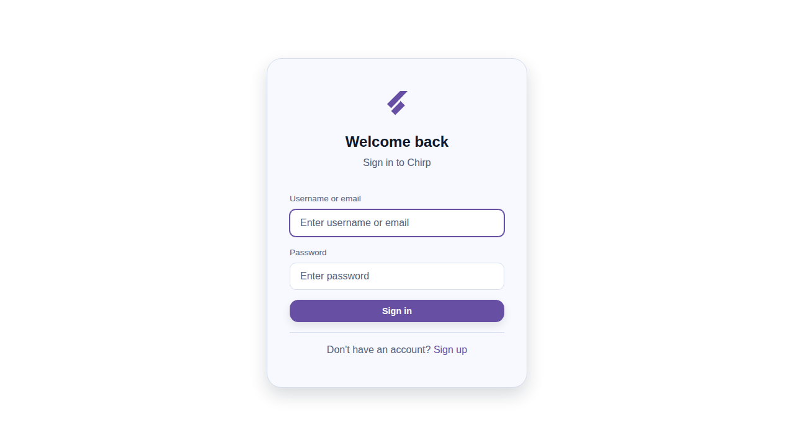
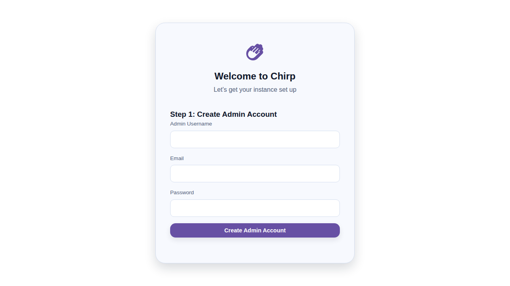
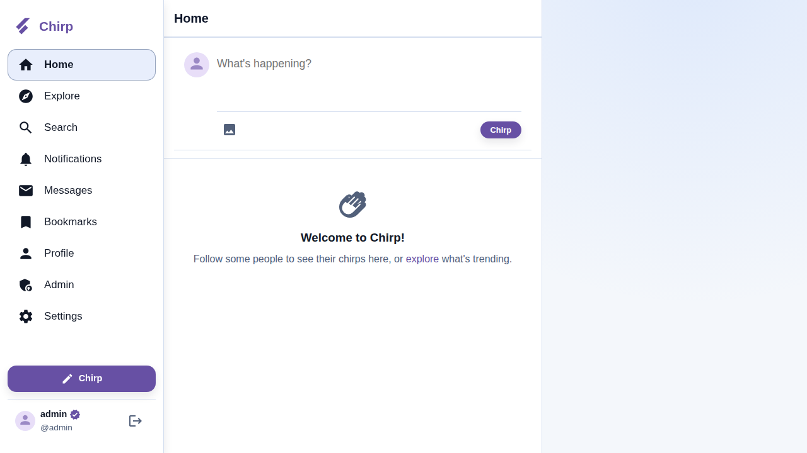
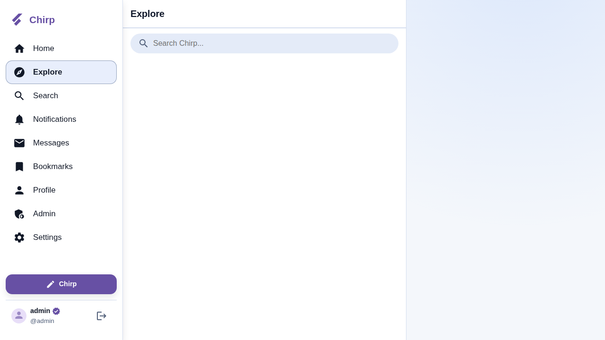
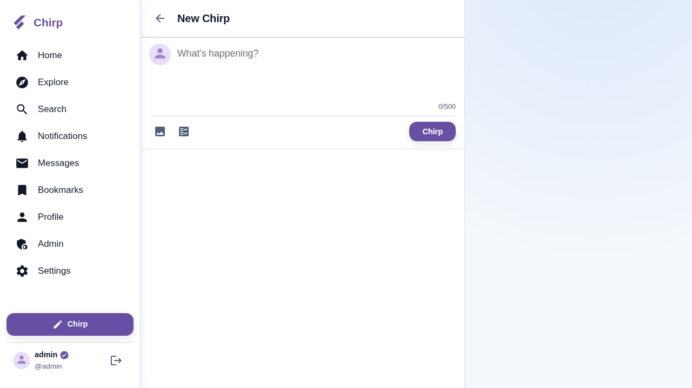
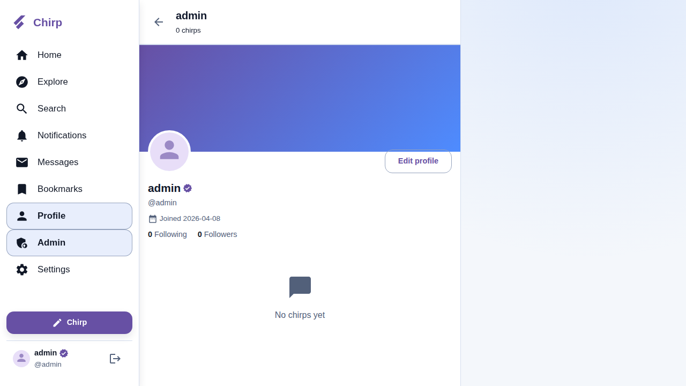

# 🐦 Chirp

A modern, self-hosted social media platform built with Flask, SQLite3, and a clean, contemporary adaptive UI.



## Screenshots

### First-Run Setup
Guided setup wizard to create the admin account and configure your instance.



### Home Feed
The home timeline with quick compose and a chronological post feed.



### Explore
Discover trending hashtags, suggested users to follow, and popular chirps.



### Compose
Create chirps with text, images, and polls. Character count and media toolbar included.



### Profile
User profiles with avatar, bio, follower/following counts, and chirp history.



## Features

### Core
- **User System**: Registration, login, profiles with avatars/banners, follow/unfollow, block/mute, privacy settings
- **Posts (Chirps)**: Text posts (500 chars), image attachments, polls, edit history (30 min window), hashtags, @mentions
- **Interactions**: Like, rechirp (retweet), reply, quote chirp, bookmark, share
- **Feed**: Chronological home timeline, explore page with trending hashtags/posts, search (posts, users, hashtags)
- **Verification**: User verification badges, corporation verification (square avatars, distinct badge), and affiliation system (corp users can affiliate others, showing the corp's profile picture next to the badge)

### Community & Moderation
- **Community Notes**: Any user can propose notes on posts with sources; auto-approved at 3+ helpful ratings
- **Staff Notes**: Admin/moderator-only official annotations on posts (warning, misleading, violation, etc.)
- **Site Announcements**: Banner/modal/in-feed announcements, dismissible, with targeting options
- **Report System**: Users can report posts/users; admin review queue with resolve/dismiss/delete actions

### Administration
- **Dashboard**: Real-time stats (users, posts, reports, registrations)
- **User Management**: Search, verify, suspend, ban, promote moderators, delete users, grant corporation verification
- **Content Moderation**: Reports queue, staff notes, community notes oversight
- **Site Settings**: Customizable site name, description, theme color, registration mode
- **Audit Log**: Full admin action trail

### Communication
- **Direct Messages**: One-on-one conversations, group DMs, unread indicators
- **Notifications**: Likes, follows, replies, rechirps, mentions, messages with unread count

### Design
- **Modern Adaptive UI**: Contemporary styling system with dynamic color theming and smooth animations
- **Light/Dark/Auto themes** with accent color picker
- **Responsive Design**: Desktop sidebar navigation, mobile bottom navigation
- **Accessibility**: Reduced motion support, proper semantic HTML, keyboard shortcuts

### Technical
- **REST API** with rate limiting (`/api/v1/`)
- **Security**: CSRF protection, XSS prevention (bleach), bcrypt password hashing, security headers
- **Docker**: Single `docker-compose up` deployment with nginx reverse proxy
- **SQLite3**: WAL mode, 24 tables, 17 indexes, proper foreign keys

## Quick Start

### With Docker (Recommended)

```bash
# Clone the repository
git clone https://github.com/m4rcel-lol/Chirp.git
cd Chirp

# Run the installer
chmod +x install.sh
./install.sh

# Or manually:
cp .env.example .env
# Edit .env with your settings
docker-compose up -d
```

### Without Docker (Development)

```bash
cd app
pip install -r requirements.txt

# Set environment variables
export DATABASE_PATH=database/chirp.db
export SECRET_KEY=$(python -c "import secrets; print(secrets.token_hex(32))")

# Run the app
python main.py
```

Visit `http://localhost:8080/setup` to create your admin account.

## First-Run Setup

1. Navigate to `/setup`
2. Create your admin account (username, email, password)
3. Configure site name, description, and theme color
4. Start chirping! 🐦

## Project Structure

```
chirp/
├── docker-compose.yml          # Docker services (web + nginx)
├── Dockerfile                  # Python 3.12 Alpine image
├── install.sh                  # One-command installer
├── .env.example                # Environment configuration template
├── nginx/
│   └── nginx.conf              # Reverse proxy configuration
├── app/
│   ├── main.py                 # Flask application entry point
│   ├── database.py             # SQLite3 schema & connection management
│   ├── requirements.txt        # Python dependencies
│   ├── routes/
│   │   ├── auth.py             # Authentication, profiles, follow/block
│   │   ├── posts.py            # Chirps, likes, reposts, community notes
│   │   ├── feed.py             # Timeline, explore, search, hashtags
│   │   ├── admin.py            # Administration panel
│   │   ├── messages.py         # Direct messages
│   │   ├── notifications.py    # Notification system
│   │   ├── api.py              # REST API endpoints
│   │   └── setup.py            # First-run setup wizard
│   ├── templates/              # Jinja2 HTML templates
│   └── static/
│       ├── css/style.css       # Modern adaptive stylesheet
│       ├── js/app.js           # Client-side JavaScript
│       └── img/                # Static images
├── uploads/                    # User-uploaded media
└── tests/
    └── test_app.py             # Test suite
```

## API Endpoints

| Method | Endpoint | Description |
|--------|----------|-------------|
| GET | `/api/v1/timeline` | Get home timeline |
| GET | `/api/v1/posts/<id>` | Get a specific post |
| POST | `/api/v1/posts` | Create a new post |
| POST | `/api/v1/posts/<id>/like` | Like/unlike a post |
| GET | `/api/v1/users/<username>` | Get user profile |
| GET | `/api/v1/search?q=&type=` | Search posts/users |
| GET | `/api/v1/trending` | Get trending hashtags |

All API endpoints are rate-limited to 60 requests/minute.

## Environment Variables

| Variable | Default | Description |
|----------|---------|-------------|
| `DOMAIN` | `localhost` | Your domain name |
| `SECRET_KEY` | auto-generated | Flask secret key |
| `DATABASE_PATH` | `/app/database/chirp.db` | SQLite database path |
| `ENABLE_REGISTRATION` | `true` | Allow new registrations |
| `ENABLE_COMMUNITY_NOTES` | `true` | Enable community notes |
| `MAX_IMAGE_SIZE` | `10485760` | Max image upload (bytes) |
| `MAX_VIDEO_SIZE` | `104857600` | Max video upload (bytes) |
| `SMTP_HOST` | - | Email server host |
| `SESSION_LIFETIME` | `7200` | Session duration (seconds) |

## Security

- CSRF protection on all forms
- XSS prevention via bleach sanitization
- bcrypt password hashing
- Security headers (X-Content-Type-Options, X-Frame-Options, X-XSS-Protection)
- Rate limiting on API endpoints
- Parameterized SQL queries (no SQL injection)

## License

MIT
